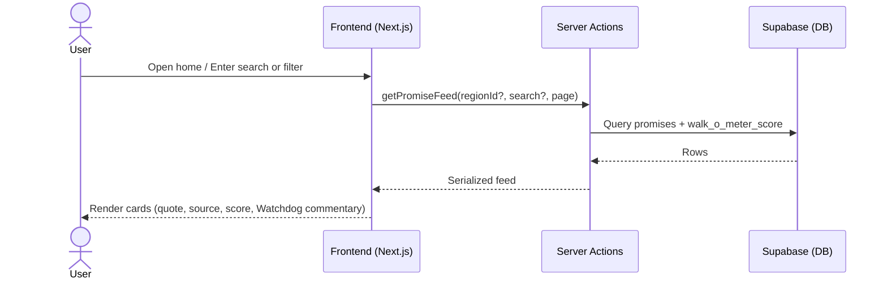
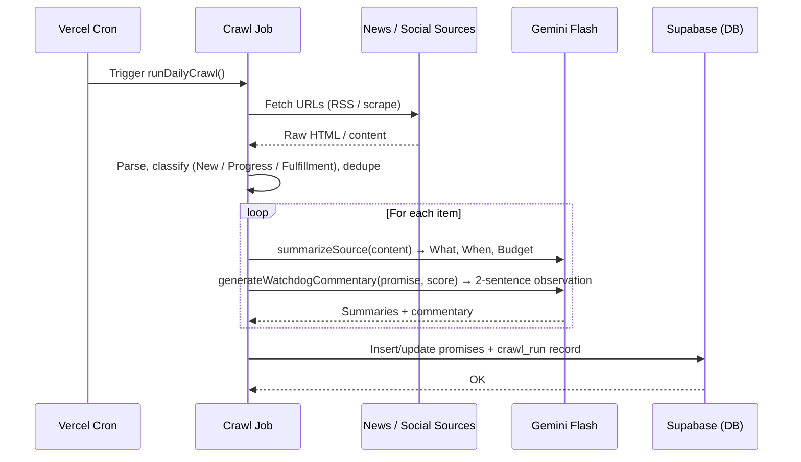
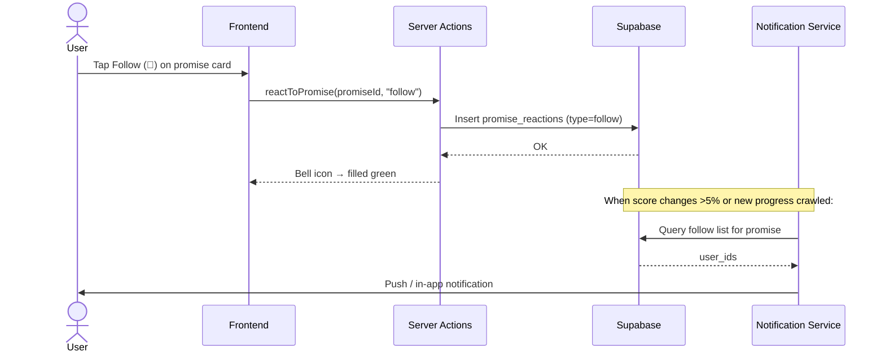

# Feature: Promise Tracker & Daily Webcrawl (The Talk Ledger)

> **File naming:** `feature-promise-tracker.md`

---

## 1. Overview

| Field | Description |
|-------|-------------|
| **Feature ID** | `F-001` |
| **Objective** | To create a continuously updated, publicly verifiable database of environmental promises, tracking their progress and fulfillment to hold officials accountable. |
| **Summary** | The Talk Ledger is the app's public home page — a searchable feed of environmental promises. Each card shows the quote, source, Walk-o-Meter score, AI summary, and Bang Jaga Watchdog commentary. A daily webcrawl ingests news and social media into three categories (New Promises, Progress Updates, Fulfillment Tracking). Gemini Flash summarizes long docs into "What was promised," "When," and "The Budget." Users can Like, Comment, Share, Follow, Flag as BS, and Submit new promises. |
| **Related PRD** | PRD §4.1 |

---

## 2. Functional Requirements

### 2.1 User Stories / Use Cases

| ID | As a… | I want to… | So that… | Priority |
|----|--------|------------|----------|----------|
| US-01 | Citizen | See a feed of promises with quote, source, and verification score | I can quickly judge who said what and how it's being verified | P0 |
| US-02 | Citizen | Search or filter by region, official, year, status | I find promises relevant to my area | P0 |
| US-03 | Citizen | Read an AI summary (what, when, budget) | I understand the promise without reading 50-page PDFs | P0 |
| US-04 | System | Run a daily crawl of news and social media | The database stays up to date automatically | P0 |
| US-05 | System | Classify crawled items as New Promise / Progress / Fulfillment | Data is structured for tracking and analytics | P0 |
| US-06 | Citizen | Follow a promise to get notified when it changes | I don't have to keep checking manually | P1 |
| US-07 | Citizen | Flag a promise card as misleading or wrong | Community can signal low-quality data to admins | P1 |
| US-08 | Citizen | Comment on a promise card | I can add context or discuss with others | P1 |
| US-09 | Citizen | Submit a new promise not in the system | I can add promises the crawler missed | P2 |
| US-10 | Citizen | See a Watchdog Commentary on each promise | I get a plain-language accountability read without research | P1 |

### 2.2 Acceptance Criteria

- [ ] **AC-01:** Home feed loads showing quote/summary, source, date, and Walk-o-Meter score per card.
- [ ] **AC-02:** Search and filter (region, politician, year, status) return the correct subset of promises.
- [ ] **AC-03:** For long sources (PDFs, long articles), a 3-bullet AI summary is shown: What, When, Budget.
- [ ] **AC-04:** Daily cron runs successfully; new/updated items appear in the feed after processing.
- [ ] **AC-05:** Crawled items are tagged: New Promise, Progress Update, or Fulfillment.
- [ ] **AC-06:** Authenticated users can follow a promise; notification is triggered on score change >5% or new progress update.
- [ ] **AC-07:** Authenticated users can flag a promise; at ≥10 flags an admin alert is triggered.
- [ ] **AC-08:** Authenticated users can comment (max 500 chars); comments with ≥5 flags are auto-hidden.
- [ ] **AC-09:** User-submitted promises enter a pending moderation queue; submitter is notified on approval or rejection.
- [ ] **AC-10:** Watchdog Commentary is generated at crawl time, stored in DB, and displayed on the card.
- [ ] **AC-11:** Source URLs with 404 status show: "Original source no longer available."

### 2.3 Business Rules

- **BR-01:** A promise must have at minimum: quote or summary, source URL, and date. Walk-o-Meter score defaults to 0 until community input exists.
- **BR-02:** Crawler must not duplicate existing promises. Dedup by source URL + quote fingerprint.
- **BR-03:** AI summaries are generated only for sources above a length threshold (e.g. PDFs, articles > 500 words). Short quotes are used as-is.
- **BR-04:** Each user may cast **one Like** per promise. One follow per promise. One flag per promise (per reason type).
- **BR-05:** Watchdog Commentary uses a fixed system prompt; output is stored and may be reviewed by an admin before publishing. Max 2 sentences. No personal attacks.
- **BR-06:** Source URL validation runs weekly. `source_status` is updated to `404` or `paywalled` accordingly.
- **BR-07:** User-submitted promises are attributed "Submitted by community · Verified by WIWOKDETOK team" after approval.
- **BR-08:** Flag threshold for admin review: ≥10 unique users. Admin can dismiss, edit, or remove.

### 2.4 Feature Dependencies

| Feature | Reference | Dependency type |
|---------|-----------|-----------------|
| Region hierarchy | PRD §3.3 | Required — filter/drill-down |
| Walk-o-Meter | `feature-walk-o-meter.md` | Required — supplies Walk-o-Meter score per promise |
| Bang Jaga | `feature-bang-jaga.md` | Optional — may link complaints to a promise (P1) |

---

## 3. Non-Functional Requirements

### 3.1 Performance

- **Latency:** Home feed FCP < 2s (p95); search/filter response < 1.5s.
- **Throughput:** Feed and search support concurrent reads; crawl runs once per day.
- **Data volume:** Pagination at 20 items per page; support 10k+ promises without degradation.

### 3.2 Availability & Reliability

- **Uptime:** Aligns with Vercel/Supabase SLA. Feed is read-heavy; no hard dependency on crawl completion for serving.
- **Error handling:** Failed crawl does not break the feed. Stale data shown with "last updated" indicator. Crawl retries with exponential backoff.

### 3.3 Security & Privacy

- **Auth:** Feed and search are public (no login required for read). Write actions (Flag, Comment, Follow, Submit promise) require authentication.
- **Data:** Source URLs and quotes are public by design. Crawler must respect `robots.txt` and rate limits. No PII in promise content.
- **Compliance:** Ethical scraping and attribution.

### 3.4 Accessibility & UX

- **A11y:** WCAG 2.1 AA; min tap target 48×48dp.
- **Localization:** ID primary; designed for future EN.
- **Offline / low data:** Data-Saver mode reduces image quality; no heavy animations; system font fallback.

### 3.5 Scalability & Limits

- **Crawl:** Rate-limit external fetches; use Vercel Cron + queue (e.g. Inngest/QStash) for crawl jobs.
- **Storage:** Promises and summaries in Supabase; raw crawl cache optional with defined retention.
- **Comments:** Paginated at 20 per load; flat (non-threaded) for MVP.

---

## 4. Technical Requirements

### 4.1 Architecture Context

- **Layer:** Frontend (Next.js App Router), Server Actions/API, Cron (daily crawl), AI (summarization + Watchdog commentary).
- **Entry points:** `/` (home feed); Server Actions for feed/search; Vercel Cron for daily crawl.

### 4.2 Feature-Specific Packages & Libraries

| Category | Technology / Package | Version | Purpose |
|----------|----------------------|---------|---------|
| **AI** | `@google/generative-ai` (Gemini Flash) | — | Summarize long docs; generate Watchdog Commentary |
| **Crawl Jobs** | Vercel Cron + Inngest or QStash | — | Daily crawl trigger and job queue |
| **Crawler** | `cheerio` / `jsdom` or `Puppeteer` (for SPAs) | — | Fetch and parse news/social pages |
| **Storage** | Supabase Storage | — | Optional: store PDFs/snapshots for sources |

### 4.3 Data Model & APIs

**Entities / tables used:**

- **`regions`:** `id`, `parent_id`, `level` (0–4), `name`, `code`
- **`promises`:** `id`, `region_id`, `quote`, `source_url`, `source_domain`, `source_status` (`active`|`404`|`paywalled`), `crawled_at`, `source_type`, `date`, `category` (`new_promise`|`progress_update`|`fulfillment`), `walk_o_meter_score`, `summary_what`, `summary_when`, `summary_budget`, `watchdog_commentary`, `submitted_by` (nullable), `created_at`, `updated_at`
- **`promise_reactions`:** `id`, `promise_id`, `user_id`, `type` (`like`|`follow`|`flag`), `flag_reason` (nullable), `created_at`
- **`promise_comments`:** `id`, `promise_id`, `user_id`, `text` (max 500), `like_count`, `flag_count`, `hidden` (bool), `created_at`
- **`promise_submissions`:** `id`, `promise_id` (nullable, set on approval), `submitted_by`, `quote`, `source_url`, `politician_name`, `date`, `status` (`pending`|`approved`|`rejected`), `admin_reason` (nullable), `created_at`
- **`crawl_runs`:** `id`, `started_at`, `finished_at`, `status`, `items_processed`, `error_log`

**Key APIs / Server Actions:**

- `getPromiseFeed(regionId?, search?, category?, status?, year?, page)` — paginated feed
- `getPromiseById(id)` — single promise with score and comments
- `runDailyCrawl()` — cron trigger; fetch, classify, dedupe, summarize, generate Watchdog commentary, write to DB
- `reactToPromise(promiseId, type, reason?)` — like / follow / flag
- `commentOnPromise(promiseId, text)` — insert comment; enforce 500-char limit
- `submitNewPromise(data)` — enter moderation queue
- `validateSourceUrls()` — weekly job to update `source_status`

**External APIs / services:**

- News/social sources: whitelist of RSS feeds and scraped URLs (TBD)
- Google Gemini API: summarization and Watchdog commentary generation

### 4.4 Configuration & Environment

- **Env vars:** `SUPABASE_URL`, `SUPABASE_ANON_KEY`, `GOOGLE_GEMINI_API_KEY`, `CRAWL_CRON_SECRET`
- **Feature flags:** `FEATURE_PROMISE_SEARCH` — advanced search; `FEATURE_USER_SUBMIT_PROMISE` — user submissions

---

## 5. Sequence Diagram (Feature & Data Flow)

### 5.1 User opens home feed and searches promises

### 5.2 Daily crawl and AI summarization

### 5.3 User follows a promise and receives a notification

---

## 6. Edge Cases & UI States

### 6.1 Empty States

| Scenario | UI Response |
|---|---|
| Search / filter returns zero results | *"No promises found matching your filters."* + [Clear Filters] button |
| Region has no promises yet | *"No promises tracked in this region yet."* + [Explore National] CTA |

### 6.2 Loading States

| Scenario | UI Response |
|---|---|
| Initial feed load | 3 skeleton card placeholders (animated shimmer) |
| Load More button tapped | Spinner on button |
| End of list reached | Button hidden; *"You've seen all promises in this view."* |

### 6.3 Error States

| Scenario | UI Response |
|---|---|
| Feed API fails | *"Couldn't load promises. Check your connection."* + [Retry] |
| Source URL is 404 | Card footnote: *"Original source no longer available."* |
| Source is paywalled | Card footnote: *"Source behind paywall — see AI summary below."* |
| Comment submission fails | Inline error under the input + [Try again] |
| PDF export fails | Toast: *"PDF generation failed."* + [Retry] + [Copy as Text] |

### 6.4 Permission & Auth States

| Scenario | UI Response |
|---|---|
| Guest taps Follow / Flag / Comment | Auth bottom-sheet modal: *"Join WIWOKDETOK — it's free."* |
| Guest taps "Submit New Promise" | Same auth modal |
| User already flagged this promise | "Flag as BS" button grayed out with tooltip: *"You've already flagged this."* |
| User already following this promise | Bell icon is filled; tap again to unfollow (with confirm tooltip) |

### 6.5 Moderation & Submission States

| Scenario | UI Response |
|---|---|
| Promise submitted by user (pending review) | Banner on user's submission: *"Under review — we'll notify you when it's live."* |
| Submission approved | Push notification + email: *"Your submission is now live!"* with a link |
| Submission rejected | Notification with admin reason |
| Comment auto-hidden (≥5 flags) | Comment replaced with: *"This comment has been removed for review."* |

---

## 7. Open Questions / Decisions

- [ ] **Q1:** Exact list of crawl sources (whitelist of domains/RSS) and rate limits.
- [ ] **Q2:** Deduplication strategy: same quote from multiple URLs — one promise or multiple?
- [ ] **Q3:** Whether to store raw PDFs in Supabase Storage for audit and re-summarization.
- [ ] **Q4:** Watchdog Commentary moderation: auto-publish or admin-review queue before going live?

---

## 8. Changelog

| Date | Author | Change |
|------|--------|--------|
| 2025-03-04 | — | Initial draft from PRD §4.1 |
| 2026-03-05 | — | Gap analysis applied: added user actions (Follow, Flag, Comment, Submit), Watchdog Commentary spec, source URL validation, moderation rules, all edge cases |
