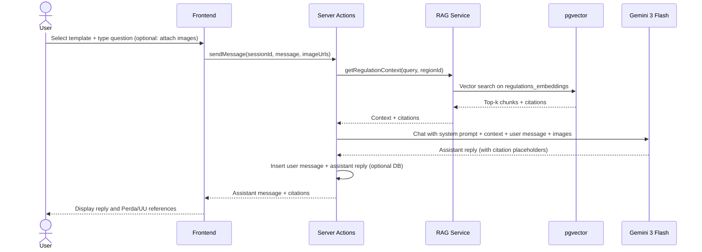
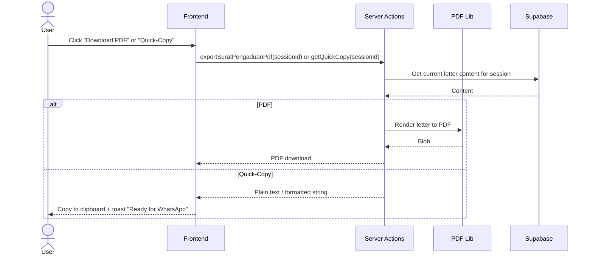
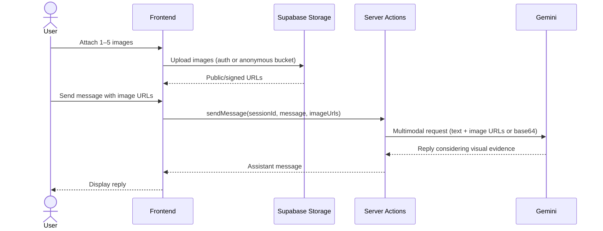

# Feature: Bang Jaga AI Legal & Policy Assistant

> **File naming:** `feature-bang-jaga.md`

---

## 1. Overview

| Field | Description |
|-------|-------------|
| **Feature ID** | `F-002` |
| **Objective** | Primary: educate users on environmental policies in their region. Secondary: act as a virtual legal assistant that guides users to draft official complaints (Surat Pengaduan) with a live preview. |
| **Summary** | An interactive chat interface for legal and policy help. Users choose guided templates (e.g. “Learn about regulations” or “Draft a complaint”), can upload up to 5 images as evidence, and get answers grounded in local Perda and national UU via RAG. The assistant generates a Surat Pengaduan with live preview; users can download PDF or use a Quick-Copy version for WhatsApp. Completed complaints can be **shared to the Walk-o-Meter map** (with location) so they appear as pins in the evidence feed (see `feature-walk-o-meter.md`). |
| **Related PRD** | PRD §4.2 |

---

## 2. Functional Requirements

### 2.1 User Stories / Use Cases

| ID | As a… | I want to… | So that… | Priority |
|----|--------|------------|----------|----------|
| US-01 | Citizen (e.g. Pak Budi) | Ask questions about environmental rules in my region | I understand what applies to my situation | P0 |
| US-02 | Citizen | Get answers that cite specific Perda or UU | I can verify and use the law with confidence | P0 |
| US-03 | Citizen | Use predefined chat templates (learn vs. draft complaint) | I don’t have to know how to phrase my request | P0 |
| US-04 | Citizen | Upload up to 5 images as evidence for my query/complaint | My complaint is supported by visual proof | P0 |
| US-05 | Citizen | See a generated Surat Pengaduan with live preview | I can review and edit before submitting | P0 |
| US-06 | Citizen | Download the letter as PDF or copy a WhatsApp-friendly version | I can submit to authorities or share easily | P0 |
| US-07 | Citizen | Have the assistant suggest or link to a relevant promise (from Promise Tracker) | I can connect my complaint to a politician’s promise | P1 |
| US-08 | Citizen | Share my completed Surat Pengaduan to the Walk-o-Meter map (with location) | My complaint appears on the map so others see the issue location | P0 |

### 2.2 Acceptance Criteria

- [ ] **AC-01:** Chat UI loads with visible template options (e.g. “Learn regulations,” “Draft Surat Pengaduan”).
- [ ] **AC-02:** User can send text messages and receive replies that include citations to Perda/UU where applicable.
- [ ] **AC-03:** User can attach up to 5 images per conversation or per complaint; images are used as context for answers and letter generation.
- [ ] **AC-04:** Surat Pengaduan is generated from conversation context; live preview updates when content changes.
- [ ] **AC-05:** User can download the letter as PDF and use a “Quick-Copy” (WhatsApp-optimized) copy action.
- [ ] **AC-06:** RAG retrieves from a knowledge base of regulations (ingested Perda/UU); responses cite document and article/section when possible.
- [ ] **AC-07:** Region is used to scope regulations (e.g. user’s regency/city) when provided or inferred.
- [ ] **AC-08:** From a completed Surat Pengaduan, user can trigger "Share to map"; flow collects or confirms location (GPS); the complaint is then sent to Walk-o-Meter and appears on the map and evidence feed (see `feature-walk-o-meter.md` AC-08).

### 2.3 Business Rules

- **BR-01:** Max 5 image uploads per complaint/session; max file size per image TBD (e.g. 5 MB); allowed types: JPEG, PNG, WebP.
- **BR-02:** Surat Pengaduan must include: complainant identity (as provided), date, subject, factual description, applicable regulation references, and request/action sought.
- **BR-03:** RAG must not invent regulation text; if no relevant doc is found, assistant must say so and suggest general steps.
- **BR-04:** Chat history and generated documents are tied to user session; persistence (e.g. save to account) is optional for MVP.

### 2.4 Feature Dependencies (References to Other Features)

| Feature | Reference | Dependency type |
|---------|-----------|-----------------|
| Region hierarchy | Shared data model (PRD §3.1) | Required — scope regulations by region |
| Walk-o-Meter | `feature-walk-o-meter.md` | Required — "Share to map" sends complaint to map/evidence feed with location |
| Promise Tracker | `feature-promise-tracker.md` | Optional — link complaint to a promise (P1) |
| Auth | Supabase Auth | Optional for MVP — anonymous chat; required for saving history/drafts |

---

## 3. Non-Functional Requirements

### 3.1 Performance

- **Latency:** First reply < 4s (p95) for simple queries; Surat Pengaduan generation < 8s; PDF export < 3s.
- **Throughput:** Support concurrent chats; rate-limit per IP/session to avoid abuse of Gemini.
- **Data volume:** RAG knowledge base: hundreds of documents (Perda/UU); embeddings in pgvector; single request context within model limits.

### 3.2 Availability & Reliability

- **Uptime:** Depends on Vercel + Supabase + Gemini API; graceful message when AI is unavailable.
- **Error handling:** Retry once for transient API errors; show user-friendly error and “Try again” for failures; do not persist broken drafts as final.

### 3.3 Security & Privacy

- **Auth:** Chat can be anonymous for MVP; optional sign-in to save history/drafts.
- **Data:** Conversation content and uploaded images may contain sensitive/PII; store only if user opts in; do not use for training; clear retention policy.
- **Compliance:** Handle PII in line with local expectations; ensure AI outputs are not presented as official legal advice (disclaimer).

### 3.4 Accessibility & UX

- **A11y:** WCAG 2.1 AA; min tap target 48x48dp; labels for file upload; keyboard-friendly chat and preview (PRD §5).
- **Localization:** ID primary; legal terminology in Indonesian.
- **Offline / low data:** Mode Hemat Data: reduce image size/quality on upload if needed; avoid heavy animations in chat (PRD §5).

### 3.5 Scalability & Limits

- **Rate limits:** Per-session or per-IP limits on chat and document generation to cap Gemini cost and abuse.
- **Storage:** Uploaded images: Supabase Storage with short retention if not saved to account; RAG docs in DB + pgvector.

---

## 4. Technical Requirements

### 4.1 Architecture Context

- **Layer:** Frontend (Next.js App Router, chat UI, live preview), Server Actions / API (chat, generate letter, PDF), RAG service (embed + retrieve), AI (Gemini 3 Flash).
- **Entry points:** `/chat` or `/bang-jaga` (chat + templates); Server Actions for sendMessage, generateSuratPengaduan, exportPdf, getQuickCopy.

### 4.2 Feature-Specific Packages & Libraries

| Category | Technology / Package | Version (optional) | Purpose |
|----------|----------------------|--------------------|---------|
| **AI** | @google/generative-ai (Gemini 3 Flash) | — | Chat, document generation, image understanding |
| **RAG** | Supabase pgvector + custom embed/retrieve | — | Store and retrieve regulation chunks; cite Perda/UU |
| **Embeddings** | Google Embedding API or Gemini | — | Vectorize regulation chunks and queries |
| **PDF** | @react-pdf/renderer or jsPDF / server-side lib | — | Generate Surat Pengaduan PDF |
| **Storage** | (Supabase Storage — feature use only) | — | User-uploaded images (temporary or per user) |

### 4.3 Data Model & APIs

**Entities / tables used:**

- **regions:** id, parent_id, level, name, code (PRD §3.1).
- **regulations:** id, region_id, type (perda | uu), title, source_url, content_text, effective_date (optional).
- **regulations_embeddings:** id, regulation_id, chunk_index, content_chunk, embedding (vector), metadata.
- **chat_sessions:** id, user_id (nullable), region_id (optional), created_at (optional for MVP).
- **chat_messages:** id, session_id, role (user | assistant), content, attachments_urls (optional), created_at.
- **generated_documents:** id, session_id, type (surat_pengaduan), content_json or html, created_at (optional for MVP).

**Key APIs / Server Actions:**

- `sendMessage(sessionId, message, imageUrls?)` — append user message, call RAG + Gemini, return assistant reply.
- `getRegulationContext(query, regionId?, limit)` — embed query, search pgvector, return top-k chunks with metadata (citation).
- `generateSuratPengaduan(sessionId, templateData)` — build letter from conversation + template; return HTML/JSON for preview.
- `exportSuratPengaduanPdf(sessionId)` — generate PDF from current letter.
- `getQuickCopy(sessionId)` — return plain-text or formatted string for WhatsApp.

**External APIs / services:**

- Google Gemini API: chat completion, vision (images), and optionally embeddings.
- (Optional) Google Embedding API or Gemini for RAG embeddings.

### 4.4 Configuration & Environment

- **Env vars:** `SUPABASE_URL`, `SUPABASE_ANON_KEY`, `SUPABASE_SERVICE_ROLE_KEY` (for RAG if needed); `GOOGLE_GEMINI_API_KEY`.
- **Feature flags:** `FEATURE_BANG_JAGA_SAVE_HISTORY` — persist chat to account; `FEATURE_PROMISE_LINK` — suggest/link Promise Tracker item.

---

## 5. Sequence Diagram (Feature & Data Flow)

### 5.1 User asks a policy question (RAG + chat)



### 5.2 Generate Surat Pengaduan and live preview

```mermaid
sequenceDiagram
    actor User
    participant UI as Frontend
    participant SA as Server Actions
    participant AI as Gemini 3 Flash
    participant DB as Supabase

    User->>UI: Request "Generate Surat Pengaduan" (after conversation)
    UI->>SA: generateSuratPengaduan(sessionId, templateData)
    SA->>DB: Load chat history + attachments metadata
    DB-->>SA: Messages
    SA->>AI: Generate letter (structure + content from history + RAG refs)
    AI-->>SA: Structured letter content
    SA->>SA: Build HTML/JSON for preview
    SA-->>UI: Letter content for preview
    UI-->>User: Live preview; user can edit (future) or confirm
```

### 5.3 Export PDF and Quick-Copy



### 5.4 Upload images as evidence



---

## 6. Open Questions / Decisions

- [ ] **Q1:** Source and update process for regulations (Perda/UU) — manual ingest vs. automated; chunking strategy for RAG.
- [ ] **Q2:** Legal disclaimer text and placement (e.g. “This is not legal advice”).
- [ ] **Q3:** Retention for anonymous chat and uploaded images (e.g. 24h then delete).
- [ ] **Q4:** Whether to support editing the generated Surat Pengaduan in the UI before export (MVP: preview only or simple edits).

---

## 7. Changelog

| Date | Author | Change |
|------|--------|--------|
| 2025-03-04 | — | Initial draft from PRD §4.2 and template |
| 2025-03-04 | — | Share to Walk-o-Meter map: US-08, AC-08, Summary, Walk-o-Meter dependency |
