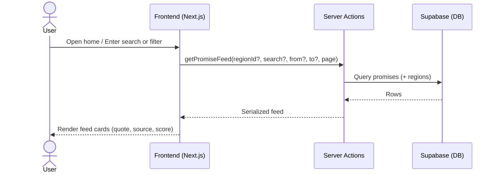
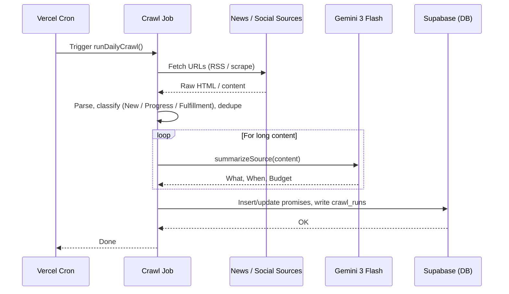
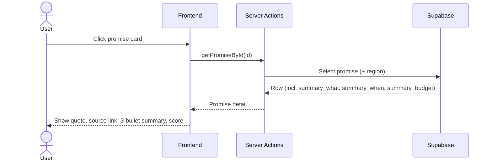

# Feature: Promise Tracker & Daily Webcrawl (Home Page)

> **File naming:** `feature-promise-tracker.md`

---

## 1. Overview

| Field | Description |
|-------|-------------|
| **Feature ID** | `F-001` |
| **Objective** | To create a continuously updated, publicly verifiable database of environmental promises, tracking their progress and fulfillment to hold officials accountable. |
| **Summary** | The home page is a searchable feed of environmental promises made by officials. Each item shows the quote, source, and **Walk-o-Meter** score (from community reporting, see `feature-walk-o-meter.md`). A daily webcrawl ingests news and social media into three categories (New Promises, Progress Updates, Fulfillment Tracking). Gemini 3 Flash summarizes long documents (e.g. PDFs) into "What was promised," "When," and "The Budget." |
| **Related PRD** | PRD §4.1 |

---

## 2. Functional Requirements

### 2.1 User Stories / Use Cases

| ID | As a… | I want to… | So that… | Priority |
|----|--------|------------|----------|----------|
| US-01 | Citizen (Pak Budi / Siska) | See a feed of environmental promises with quote, source, and verification score | I can quickly judge who said what and how it’s being verified | P0 |
| US-02 | Citizen | Search or filter promises (e.g. by region, official, date) | I can find promises relevant to my area or topic | P0 |
| US-03 | Citizen | Read a short summary (what, when, budget) instead of full documents | I understand the promise without reading 50-page PDFs | P0 |
| US-04 | System | Run a daily crawl of news and social media | The promise database stays up to date without manual entry | P0 |
| US-05 | System | Classify crawled items as New Promise / Progress Update / Fulfillment | Data is structured for tracking and analytics | P0 |
| US-06 | Citizen | Drill down by region (country → province → regency → district → village) | I see promises at the right geographic level | P1 |

### 2.2 Acceptance Criteria

- [ ] **AC-01:** Home page loads a feed of promises; each card shows quote (or summary), source URL, date, and verification score.
- [ ] **AC-02:** Search/filter by text, region, and date range returns correct subset of promises.
- [ ] **AC-03:** For items with long source content (e.g. PDF), a 3-bullet AI summary is shown: What was promised, When, Budget (if available).
- [ ] **AC-04:** Daily cron/job runs webcrawl; new/updated items appear in DB and are visible in feed after processing.
- [ ] **AC-05:** Crawled items are tagged with one of: New Promise, Progress Update, Fulfillment.
- [ ] **AC-06:** Region filter uses hierarchy (Level 0–4); selecting a region shows promises scoped to that region and children.

### 2.3 Business Rules

- **BR-01:** A “promise” must have at least: quote or summary, source URL, and date; verification score can be 0 until community input exists.
- **BR-02:** Crawler must not duplicate existing promises; matching is by source URL + quote fingerprint or defined dedup rules.
- **BR-03:** Summaries are generated only for sources above a length threshold (e.g. PDF, long article); short snippets can be used as-is.
- **BR-04:** Commitment/verification score is derived from community verification and/or progress evidence (formula TBD).

### 2.4 Feature Dependencies (References to Other Features)

| Feature | Reference | Dependency type |
|---------|-----------|-----------------|
| Region hierarchy | Shared data model (PRD §3.1) | Required — filter/drill-down |
| Walk-o-Meter | `feature-walk-o-meter.md` | Required — supplies verification (Walk-o-Meter) score for each promise |
| Bang Jaga | `feature-bang-jaga.md` | Optional — may link complaints to a promise later |

---

## 3. Non-Functional Requirements

### 3.1 Performance

- **Latency:** Home feed first contentful < 2s (p95); search/filter response < 1.5s.
- **Throughput:** Feed and search must support concurrent read traffic; crawl job runs once per day.
- **Data volume:** Pagination (e.g. 20 items per page); support 10k+ promises without degradation.

### 3.2 Availability & Reliability

- **Uptime:** Align with Vercel/Supabase SLA; feed is read-heavy, no hard dependency on crawl completion for serving.
- **Error handling:** Failed crawl runs do not break feed; stale data shown with optional “last updated” indicator; retries with backoff for crawl.

### 3.3 Security & Privacy

- **Auth:** Feed and search are public (no login required for read).
- **Data:** Source URLs and quotes are public by design; no PII in promise content; crawler must respect robots.txt and rate limits.
- **Compliance:** No special compliance beyond ethical scraping and attribution.

### 3.4 Accessibility & UX

- **A11y:** WCAG 2.1 AA; min tap target 48x48dp; high-contrast CTAs (PRD §5).
- **Localization:** ID primary; design for future EN.
- **Offline / low data:** Mode Hemat Data: placeholder for images, no heavy animations, system font (PRD §5).

### 3.5 Scalability & Limits

- **Crawl:** Rate-limit external fetches; queue crawl jobs if needed (e.g. Vercel Cron + Edge or background worker).
- **Storage:** Promises and summaries in Supabase; raw crawl cache optional with retention policy.

---

## 4. Technical Requirements

### 4.1 Architecture Context

- **Layer:** Frontend (Next.js App Router), Server Actions/API, Cron/background (daily crawl), AI (summarization).
- **Entry points:** `/` (home feed), `/api/promises` or Server Actions for feed/search; cron trigger for daily crawl (e.g. Vercel Cron).

### 4.2 Feature-Specific Packages & Libraries

| Category | Technology / Package | Version (optional) | Purpose |
|----------|----------------------|--------------------|---------|
| **AI** | @google/generative-ai (Gemini 3 Flash) | — | Summarize long docs (what/when/budget) |
| **Crawling / Jobs** | Vercel Cron or similar; optional: Inngest, QStash | — | Daily crawl trigger; queue if needed |
| **Crawler** | cheerio / jsdom or Puppeteer (if SPA) | — | Fetch and parse news/social pages |
| **Storage** | (Supabase Storage — feature use only) | — | Optional: store PDFs/snapshots for sources |

### 4.3 Data Model & APIs

**Entities / tables used:**

- **regions:** id, parent_id, level (0–4), name, code (PRD §3.1).
- **promises:** id, region_id, quote, source_url, source_type, date, category (new_promise | progress_update | fulfillment), commitment_score, summary_what, summary_when, summary_budget, created_at, updated_at.
- **crawl_runs:** id, started_at, finished_at, status, items_processed, error_log (optional).

**Key APIs / Server Actions:**

- `getPromiseFeed(regionId?, search?, from?, to?, page)` — fetch paginated promises for home/search.
- `getPromiseById(id)` — single promise detail.
- `runDailyCrawl()` — invoked by cron; fetch sources, classify, dedupe, summarize (Gemini), write to DB.
- `summarizeSource(content)` — call Gemini to produce 3-bullet summary.

**External APIs / services:**

- News/social sources: to be defined (RSS, scraped URLs, or partner APIs).
- Google Gemini API: summarization.

### 4.4 Configuration & Environment

- **Env vars:** `SUPABASE_URL`, `SUPABASE_ANON_KEY`; `GOOGLE_GEMINI_API_KEY`; `CRAWL_CRON_SECRET` (if cron secured).
- **Feature flags:** `FEATURE_PROMISE_SEARCH` — enable advanced search filters.

---

## 5. Sequence Diagram (Feature & Data Flow)

### 5.1 User opens home and searches promises

### 5.2 Daily crawl and AI summarization

### 5.3 View single promise with AI summary

---

## 6. Open Questions / Decisions

- [ ] **Q1:** Exact list of crawl sources (whitelist of domains/RSS) and rate limits.
- [ ] **Q2:** Deduplication strategy: same quote from multiple URLs = one promise or multiple?
- [ ] **Q3:** Formula for commitment/verification score (community votes vs. progress signals).
- [ ] **Q4:** Whether to store raw PDFs in Supabase Storage for audit and re-summarization.

---

## 7. Changelog

| Date | Author | Change |
|------|--------|--------|
| 2025-03-04 | — | Initial draft from PRD §4.1 and template |
