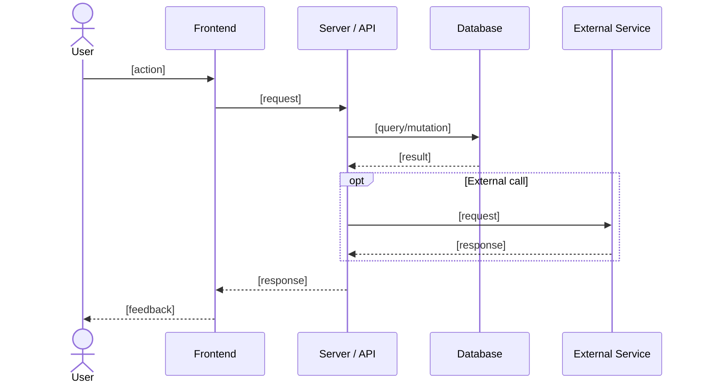
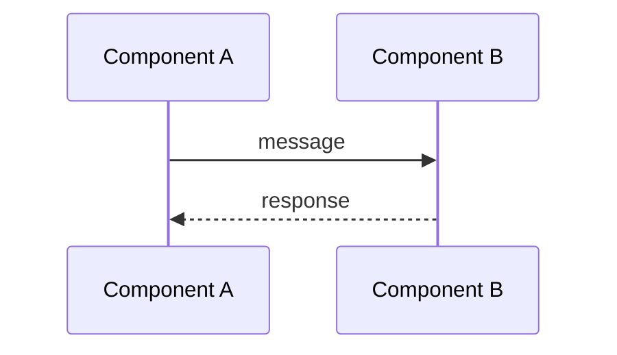

# Feature: [Feature Name]

> **File naming:** `feature-[featureName].md` (e.g. `feature-promise-tracker.md`, `feature-bang-jaga.md`)

---

## 1. Overview

| Field | Description |
|-------|-------------|
| **Feature ID** | `F-XXX` (optional, for traceability) |
| **Objective** | One sentence: what this feature achieves. |
| **Summary** | 2–3 sentences describing the feature and its value. |
| **Related PRD** | Section reference (e.g. PRD §4.1). |

---

## 2. Functional Requirements

### 2.1 User Stories / Use Cases

| ID | As a… | I want to… | So that… | Priority |
|----|--------|------------|----------|----------|
| US-01 | [role] | [action] | [outcome] | P0 / P1 / P2 |
| US-02 | … | … | … | … |

### 2.2 Acceptance Criteria

- [ ] **AC-01:** [Concrete, testable criterion]
- [ ] **AC-02:** …
- [ ] **AC-03:** …

### 2.3 Business Rules

- **BR-01:** [Rule in plain language]
- **BR-02:** …

### 2.4 Feature Dependencies (References to Other Features)

| Feature | Reference | Dependency type |
|---------|-----------|-----------------|
| [Feature name] | `feature-[name].md` | Required / Optional / Data source |
| … | … | … |

---

## 3. Non-Functional Requirements

### 3.1 Performance

- **Latency:** [e.g. p95 < 2s for key actions]
- **Throughput:** [e.g. X req/s if relevant]
- **Data volume:** [e.g. max items per page, max upload size]

### 3.2 Availability & Reliability

- **Uptime / SLA:** [if applicable]
- **Error handling:** [e.g. graceful degradation, retries]

### 3.3 Security & Privacy

- **Auth:** [e.g. public, authenticated, role-based]
- **Data:** [PII handling, retention, access control]
- **Compliance:** [if any: GDPR, local law, etc.]

### 3.4 Accessibility & UX

- **A11y:** [e.g. WCAG 2.1 AA, min tap target 48x48dp]
- **Localization:** [e.g. ID primary, EN secondary]
- **Offline / low data:** [e.g. Mode Hemat Data behavior]

### 3.5 Scalability & Limits

- **Concurrent users / rate limits:** [if applicable]
- **Storage / retention:** [if applicable]

---

## 4. Technical Requirements

### 4.1 Architecture Context

- **Layer:** [e.g. Frontend / Backend / Edge / Cron]
- **Entry points:** [e.g. route(s), API path(s), cron schedule]

### 4.2 Feature-Specific Packages & Libraries

> **Exclude app-wide stack** (e.g. framework, styling, generic backend, monitoring, testing). List only **libraries and services specific to this feature**.

| Category | Technology / Package | Version (optional) | Purpose |
|----------|----------------------|--------------------|---------|
| [Feature-specific, e.g. **AI**] | e.g. @google/generative-ai | — | Summarization for this feature only |
| [e.g. **Crawler**] | e.g. cheerio, Puppeteer | — | … |
| [e.g. **PDF**] | e.g. lib for document export | — | … |
| **Other** | … | … | … |

### 4.3 Data Model & APIs

**Entities / tables used:**

- `[EntityName]`: [brief description and key fields]

**Key APIs / Server Actions:**

- `[actionOrEndpointName]`: [method] — [one-line description]
- …

**External APIs / services:**

- [Service name]: [purpose]

### 4.4 Configuration & Environment

- **Env vars:** `[NAME]` — [purpose]
- **Feature flags:** `[flag_name]` — [when to use]

---

## 5. Sequence Diagram (Feature & Data Flow)

Use Mermaid `sequenceDiagram` for main flows. Duplicate the block per flow if needed.

### 5.1 [Flow name, e.g. "User submits a promise report"]

### 5.2 [Another flow name, if needed]

---

## 6. Open Questions / Decisions

- [ ] **Q1:** [Question or ADR to be decided]
- [ ] **Q2:** …

---

## 7. Changelog

| Date | Author | Change |
|------|--------|--------|
| YYYY-MM-DD | — | Initial draft from template |
