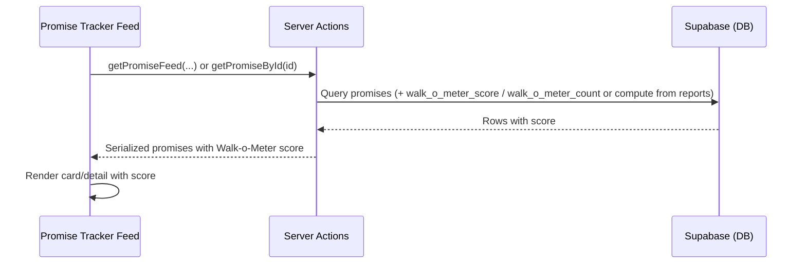
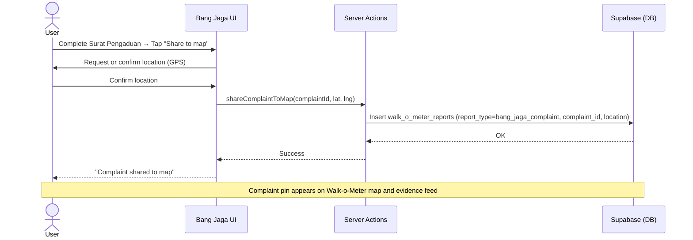

# Feature: Walk-o-Meter (Map & Evidence Feed)

> **File naming:** `feature-walk-o-meter.md`

---

## 1. Overview

| Field | Description |
|-------|-------------|
| **Feature ID** | `F-003` |
| **Objective** | To surface real-world evidence ("The Walk") on a map and in an evidence feed, combining community verification of promises and citizen complaints from Bang Jaga, and to feed Gap analytics. |
| **Summary** | The Walk-o-Meter is a **map and evidence feed** showing two types of reports: (1) **Promise-related:** users vote *Is it happening?* (Yes/No) on a promise with photo + GPS; votes aggregate into the Walk-o-Meter score per promise (shown in Promise Tracker). (2) **Bang Jaga complaints:** complaints (Surat Pengaduan) created in Bang Jaga can be shared to the map with location so they appear as pins in the evidence feed. Both types require location and photo evidence. The map gives a unified view of verification activity and formal complaints. |
| **Related PRD** | PRD §4.3 |

---

## 2. Functional Requirements

### 2.1 User Stories / Use Cases

| ID | As a… | I want to… | So that… | Priority |
|----|--------|------------|----------|----------|
| US-01 | Citizen (Pak Budi / Siska) | Vote Yes or No on whether a promise is happening | My experience on the ground is counted in the verification score | P0 |
| US-02 | Citizen | Submit my promise vote with a photo and my location (GPS) | My report is credible and tied to a real place | P0 |
| US-03 | Citizen | See the current Walk-o-Meter score on each promise in the Promise Tracker feed | I can quickly see how the community rates fulfillment | P0 |
| US-04 | Citizen | View the map and evidence feed with both promise-related reports and Bang Jaga complaints | I see all on-the-ground activity in one place | P0 |
| US-05 | Citizen | Filter or distinguish on the map between promise verifications and complaint reports | I can focus on the type of report I care about | P1 |
| US-06 | Citizen | After drafting a Surat Pengaduan in Bang Jaga, share it to the Walk-o-Meter map (with location) | My complaint appears on the map and others can see the issue location | P0 |
| US-07 | Citizen | View my own past reports (if authenticated) | I can track what I've contributed | P1 |
| US-08 | System | Aggregate promise votes (with photo + location) into a single Walk-o-Meter score per promise | The Promise Tracker can display one clear indicator per promise | P0 |

### 2.2 Acceptance Criteria

- [ ] **AC-01:** From a promise detail (or card), user can start "Report / Vote"; flow collects Yes/No, one photo (min), and GPS location.
- [ ] **AC-02:** Submission is rejected if photo is missing or location is missing/invalid; user sees clear error.
- [ ] **AC-03:** Each valid report is stored and contributes to the promise’s Walk-o-Meter score; score is visible in the Promise Tracker feed and on promise detail.
- [ ] **AC-04:** Walk-o-Meter score is computed from validated reports only (reports that have both photo and location).
- [ ] **AC-05:** Photo is uploaded to persistent storage (e.g. Supabase Storage); URL and metadata (location, vote, promise_id, user_id if auth) are stored in DB.
- [ ] **AC-06:** Reports (or aggregated score) are available for "Walk" / Gap analytics (data model supports linking to Realizations and Gap).
- [ ] **AC-07:** Walk-o-Meter map and evidence feed display both report types: promise-related (vote + photo + location) and Bang Jaga complaint reports (complaint shared to map with location); UI allows filter or visual distinction by type.
- [ ] **AC-08:** From Bang Jaga, user can "Share to map" a completed Surat Pengaduan; flow collects or confirms location (GPS); the complaint then appears on the Walk-o-Meter map and in the evidence feed with type "complaint."

### 2.3 Business Rules

- **BR-01:** A **promise-related** report (vote) is valid only if it has at least one photo and a location tag (GPS). No photo-only or location-only submissions.
- **BR-02:** Walk-o-Meter score is derived only from valid promise-related reports. Formula TBD (e.g. % Yes, weighted by recency, or simple Yes/(Yes+No)).
- **BR-03:** One vote per user per promise (if authenticated); anonymous submissions TBD (e.g. rate-limit by device/IP + same photo+location rules).
- **BR-04:** **Bang Jaga complaint** reports on the map require a location (GPS) when shared; they reference the generated Surat Pengaduan (e.g. document id or summary). They do not affect the Walk-o-Meter score of a promise; they are a separate report type for the evidence feed.
- **BR-05:** Photos are retained for audit and moderation; retention and deletion policy TBD.
- **BR-06:** Location must be within a valid region in the hierarchy (Level 0–4) or within a reasonable distance of the promise region for a promise-related report to count (optional rule to reduce off-topic reports).

### 2.4 Feature Dependencies (References to Other Features)

| Feature | Reference | Dependency type |
|---------|-----------|-----------------|
| Promise Tracker | `feature-promise-tracker.md` | Required — provides promises to vote on; consumes Walk-o-Meter score for display |
| Bang Jaga | `feature-bang-jaga.md` | Required — complaint reports on the map originate from Surat Pengaduan created in Bang Jaga; "Share to map" flow |
| Region hierarchy | Shared data model (PRD §3.1) | Optional — for scoping/validating location to region |
| Auth (if used) | App-wide | Optional for MVP — can support anonymous reports with rate limits |

---

## 3. Non-Functional Requirements

### 3.1 Performance

- **Latency:** Submit report (photo upload + metadata) < 5s p95; score read is part of promise feed (same as Promise Tracker).
- **Throughput:** Support burst of reports (e.g. event-driven); photo upload via signed URL or chunked upload if needed.
- **Data volume:** Pagination for "my reports" if implemented; single promise can have hundreds of reports — aggregation must remain fast (e.g. stored aggregate or materialized score).

### 3.2 Availability & Reliability

- **Uptime:** Align with app SLA; report submission should degrade gracefully (e.g. queue if storage temporarily unavailable).
- **Error handling:** Failed photo upload returns clear error; partial submit (e.g. metadata saved, photo failed) should be retryable or marked incomplete.

### 3.3 Security & Privacy

- **Auth:** TBD: authenticated users for one-vote-per-user; or anonymous with device/IP rate limit and strict photo+location requirement.
- **Data:** Photos and location are sensitive; store with access control; do not expose raw location in public API; aggregate (e.g. region-level) only for display if needed. PII in photos is user responsibility; retention policy and moderation plan required.
- **Compliance:** Align with local data protection; user consent for location and photo storage.

### 3.4 Accessibility & UX

- **A11y:** WCAG 2.1 AA; min tap target 48x48dp for Yes/No and submit; camera/gallery and location permission flows must be clear and cancellable.
- **Localization:** ID primary; design for future EN.
- **Offline / low data:** Mode Hemat Data: allow submission but warn on photo size; or defer upload when back online (optional).

### 3.5 Scalability & Limits

- **Rate limits:** Per user/device: e.g. max N reports per day to limit spam; per promise: no hard limit on reports.
- **Storage:** Photo storage (Supabase Storage) with quota and retention; DB rows for reports and aggregated score.

---

## 4. Technical Requirements

### 4.1 Architecture Context

- **Layer:** Frontend (Next.js App Router), Server Actions (submit report, get score, share complaint to map), Storage (photos), DB (reports, promise score).
- **Entry points:** (1) Walk-o-Meter map + evidence feed (dedicated route, e.g. `/walk-o-meter`); (2) Report flow from Promise Tracker (e.g. "Vote" on promise detail or card); (3) "Share to map" from Bang Jaga after drafting Surat Pengaduan. APIs: `submitWalkOMeterReport`, `getWalkOMeterScore`, `getMapReports(regionId?, reportType?, page)`, `shareComplaintToMap(complaintId, latitude, longitude)`.

### 4.2 Feature-Specific Packages & Libraries

| Category | Technology / Package | Version (optional) | Purpose |
|----------|----------------------|--------------------|---------|
| **Geo** | Browser Geolocation API; optional: server-side validation lib | — | Capture and validate GPS; optional reverse-geocode to region |
| **Images** | Next.js Image or client resize (e.g. browser-image-compression) | — | Resize/compress before upload to save storage and bandwidth |
| **Storage** | Supabase Storage | — | Store report photos with policy (e.g. authenticated upload, public read via signed URL or not) |

### 4.3 Data Model & APIs

**Entities / tables used:**

- **promises:** (existing) Add or use field `walk_o_meter_score` (numeric or JSON) and optionally `walk_o_meter_count` (number of reports) for display. Alternatively score is computed on read from reports where `report_type = 'promise_verification'`.
- **walk_o_meter_reports:** id, **report_type** (promise_verification | bang_jaga_complaint), promise_id (nullable; required for promise_verification), vote (yes | no; for promise_verification only), photo_url (Supabase Storage path), latitude, longitude, region_id (optional), user_id (optional, nullable), **complaint_id** (nullable; reference to Bang Jaga complaint/Surat Pengaduan when report_type = bang_jaga_complaint), created_at. Optional: status (pending | accepted | rejected for moderation).
- **regions:** (existing) For optional validation of location.
- **Bang Jaga complaints / Surat Pengaduan:** (in Bang Jaga feature) When shared to map, a row in `walk_o_meter_reports` with report_type = bang_jaga_complaint and complaint_id set; location comes from user at share time.

**Key APIs / Server Actions:**

- `submitWalkOMeterReport(promiseId, vote, photoFile, latitude, longitude)` — validate input, upload photo, insert report with report_type = promise_verification, optionally recompute/update promise Walk-o-Meter score.
- `shareComplaintToMap(complaintId, latitude, longitude)` — create a walk_o_meter_reports row with report_type = bang_jaga_complaint, complaint_id, location; complaint must have at least one photo/evidence (from Bang Jaga flow).
- `getMapReports(regionId?, reportType?, page)` — list reports for map/evidence feed, filterable by region and report type (promise_verification | bang_jaga_complaint).
- `getWalkOMeterScore(promiseId)` — return current score and optionally report count (or embedded in `getPromiseById`); based only on promise_verification reports.
- `getMyReports(userId?)` — list reports by user (P1).

**External APIs / services:**

- None required; optional: reverse geocoding to map lat/lng to region_id.

### 4.4 Configuration & Environment

- **Env vars:** `SUPABASE_URL`, `SUPABASE_ANON_KEY` (or service role for upload); bucket name for report photos.
- **Feature flags:** `FEATURE_WALK_O_METER` — enable voting and score display; `FEATURE_WALK_O_METER_AUTH_REQUIRED` — require login to submit.

---

## 5. Sequence Diagram (Feature & Data Flow)

### 5.1 User submits a Walk-o-Meter report (vote + photo + location)

```mermaid
sequenceDiagram
    actor User
    participant UI as Frontend (Next.js)
    participant SA as Server Actions
    participant Storage as Supabase Storage
    participant DB as Supabase (DB)

    User->>UI: Open promise → Tap "Vote" (Yes/No)
    UI->>User: Request camera/gallery + location permission
    User->>UI: Provide photo + allow location
    UI->>SA: submitWalkOMeterReport(promiseId, vote, photoFile, lat, lng)
    SA->>SA: Validate (photo present, location valid)
    alt Validation fail
        SA-->>UI: Error (e.g. "Photo and location required")
        UI-->>User: Show error
    else Valid
        SA->>Storage: Upload photo (promise_id / report_id path)
        Storage-->>SA: photo_url
        SA->>DB: Insert walk_o_meter_reports (+ optional score update)
        DB-->>SA: OK
        SA-->>UI: Success (updated score)
        UI-->>User: Confirm "Report submitted"; show updated Walk-o-Meter
    end
```

### 5.2 Promise Tracker displays Walk-o-Meter score



### 5.3 User shares Bang Jaga complaint to Walk-o-Meter map



---

## 6. Open Questions / Decisions

- [ ] **Q1:** One vote per user per promise (auth required) vs anonymous with rate limit (e.g. per IP/device). Trade-off: accountability vs friction.
- [ ] **Q2:** Walk-o-Meter score formula: % Yes, time-decay weight, or simple Yes/(Yes+No). Decide with product.
- [ ] **Q3:** Photo moderation: manual review queue, or auto-accept and flag later? Retention period for photos.
- [ ] **Q4:** Whether location must fall within the promise’s region (or within X km) for the report to count.
- [ ] **Q5:** Promise Tracker `feature-promise-tracker.md` Q3 (formula for commitment/verification score): confirm that Walk-o-Meter score is that verification score or a separate field displayed together.
- [ ] **Q6:** Map pin styling: different marker or color for promise_verification vs bang_jaga_complaint so users can distinguish at a glance.

---

## 7. Changelog

| Date | Author | Change |
|------|--------|--------|
| 2025-03-04 | — | Initial draft from PRD §4.3 and feature template |
| 2025-03-04 | — | Walk-o-Meter as map + evidence feed; two report types (promise-related, Bang Jaga complaints); share complaint to map flow; data model report_type, complaint_id; Bang Jaga dependency |
