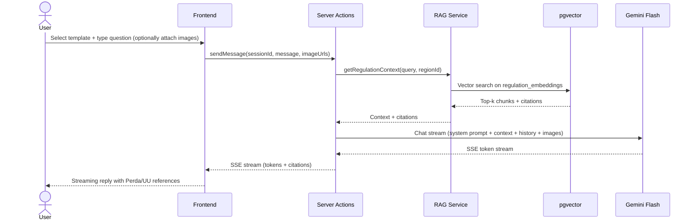
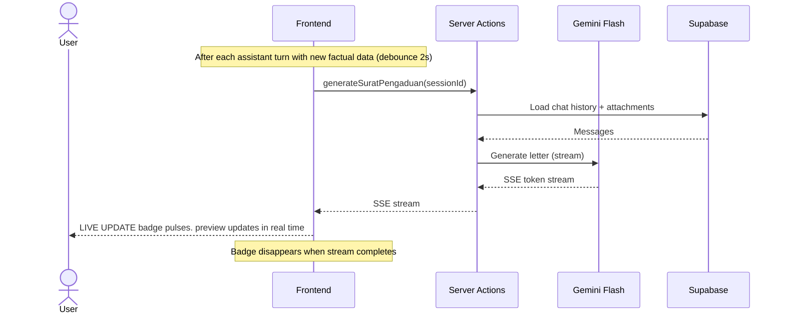
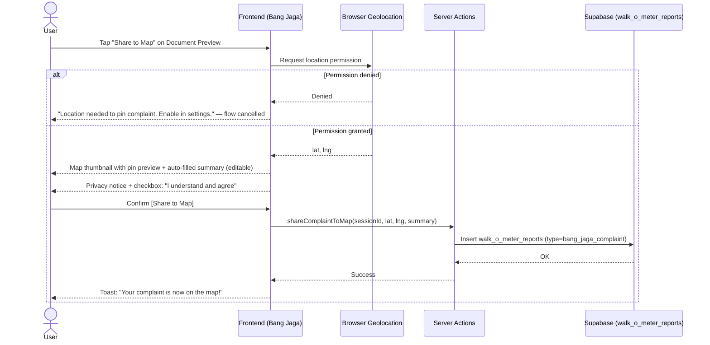
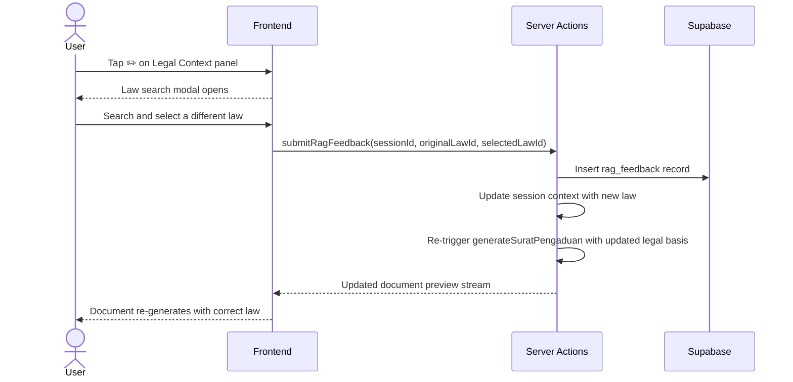

# Feature: Bang Jaga AI — Legal & Policy Assistant

> **File naming:** `feat-bang-jaga.md`

---

## 1. Overview

| Field | Description |
|-------|-------------|
| **Feature ID** | `F-002` |
| **Objective** | Primary: educate citizens on environmental policies in their region. Secondary: guide users to draft official complaints (Surat Pengaduan) with a live-streaming preview. |
| **Summary** | An authenticated, interactive chat interface for legal and policy help. Users pick guided templates ("Learn Regulations," "Draft Surat Pengaduan," "Report Pollution"), upload up to 5 images as evidence, and get answers grounded in local *Perda* and national *UU* via RAG. The assistant streams a live Surat Pengaduan preview; users can download PDF or Quick-Copy for WhatsApp. Completed complaints can be shared to the Walk-o-Meter map. Chat sessions are persisted per user account with AI-generated session titles. |
| **Related PRD** | PRD §4.2 |

> **Bang Jaga as Feature vs. Persona:**
> - **Bang Jaga (Feature):** The structured chat interface at `/chat`. Authenticated only.
> - **Bang Jaga (Persona):** The AI's name and avatar used across the whole app (e.g., Watchdog Commentary on The Talk Ledger). Both share the same Gemini model with **distinct system prompts** per context.

---

## 2. Functional Requirements

### 2.1 User Stories / Use Cases

| ID | As a… | I want to… | So that… | Priority |
|----|--------|------------|----------|----------|
| US-01 | Citizen (Pak Budi) | Ask questions about environmental rules in my region | I understand what applies to my situation | P0 |
| US-02 | Citizen | Get answers that cite specific Perda or UU | I can verify the law with confidence | P0 |
| US-03 | Citizen | Use a predefined chat template | I don't have to know how to phrase my request | P0 |
| US-04 | Citizen | Explicitly trigger a law-search query ("Search Laws") | I get a structured list of relevant regulations, not a conversational reply | P2 (deferred) |
| US-05 | Citizen | Upload up to 5 images as evidence | My complaint is backed by visual proof | P0 |
| US-06 | Citizen | See a live-streaming Surat Pengaduan preview | I can watch the document build in real time | P0 |
| US-07 | Citizen | Download the letter as PDF or copy a WhatsApp version | I can submit to authorities or share easily | P0 |
| US-08 | Citizen | Share my Surat Pengaduan to the Walk-o-Meter map | My complaint appears on the map so others see the issue | P0 |
| US-09 | Citizen | Correct the cited law in the Legal Context panel | I can fix wrong citations and improve the AI's output | P1 |
| US-10 | Citizen | Have my chat sessions saved and accessible from a sidebar | I can continue past consultations without losing context | P1 |

### 2.2 Acceptance Criteria

- [ ] **AC-01:** Chat loads with an empty-state greeting, 3 template chips, and privacy notice.
- [ ] **AC-02:** User can send text messages and receive replies citing Perda/UU via RAG.
- [ ] **AC-03:** *(Deferred to backlog)* "Search Laws (RAG)" chip returns a structured list of regulation citations, not a paragraph. MVP: RAG context is embedded in chat responses with inline citations.
- [ ] **AC-04:** User can upload up to 5 images (JPG/PNG/WEBP, max 5MB each, 20MB total); images are used as multimodal context.
- [ ] **AC-05:** Document Preview panel activates only when the AI detects the user has both expressed intention and agreement to create a Surat Pengaduan. Preview content is driven by structured complaint data (subject, recipient, location, violation, legal basis) extracted from the AI response — not hardcoded. A "LIVE UPDATE" badge appears when a draft is active.
- [ ] **AC-06:** "Download PDF" sends the same structured complaint data to `POST /api/export-pdf`, ensuring preview and PDF use the same complaint data. Minor template/layout differences may exist between preview and PDF render.
- [ ] **AC-07:** "Quick-Copy WA" copies a WhatsApp-formatted version to clipboard and shows confirmation toast: "Berhasil disalin!" Falls back to `wa.me` link on clipboard failure.
- [ ] **AC-08:** "Share to Map" launches a 7-step flow: GPS request → location preview → summary edit → privacy consent → confirmation.
- [ ] **AC-09:** *(Deferred to backlog)* RAG Legal Context edit (✏️) opens a law-search modal; user-correction is logged as feedback. MVP: Users can report inaccurate responses via a per-message free-text correction, logged to `rag_feedback` with `message_id` and `content`.
- [ ] **AC-10:** Sessions are persisted per user; sidebar lists sessions grouped by TODAY / PREVIOUS 7 DAYS / older months.
- [ ] **AC-11:** Session title is AI-generated from the first user message (max 40 chars); fallback to "Chat – [date]".

### 2.3 Business Rules

- **BR-01:** Feature is **authenticated only**. Guests are redirected to the auth bottom-sheet.
- **BR-02:** Max 5 images per session. Accepted: JPG, PNG, WEBP. Max 5MB per image, 20MB total per session.
- **BR-03:** Surat Pengaduan must include: complainant identity, date, subject, factual description, applicable regulation references, and action sought.
- **BR-04:** RAG must not invent regulation text. If no match found, Bang Jaga states this and suggests general steps.
- **BR-05:** MVP: Assistant response is fetched as a complete response from Gemini and displayed with a client-side typewriter animation. True SSE streaming and debounced document generation are deferred to backlog.
- **BR-06:** *(Deferred to backlog)* The "Search Laws (RAG)" chip scopes the query to laws only. MVP: RAG context is included in every chat response inline.
- **BR-07:** Sessions are retained for 12 months. Users notified 30 days before deletion of inactive sessions.
- **BR-08:** A disclaimer is shown in every session: *"Bang Jaga is not a lawyer. Always verify legal advice independently."*
- **BR-09:** Location is required to Share to Map. If location permission is denied, the Share-to-Map flow is cancelled.

### 2.4 Feature Dependencies

| Feature | Reference | Dependency type |
|---------|-----------|-----------------|
| Region hierarchy | PRD §3.3 | Required — scope RAG searches by region |
| Walk-o-Meter | `docs/features/feat-walk-o-meter.md` | Required — "Share to Map" sends complaint to map |
| Promise Tracker | `docs/features/feat-promise-tracker.md` | Optional — link complaint to a promise (P2) |
| Auth | Supabase Auth | Required — sessions require authentication |

---

## 3. Non-Functional Requirements

### 3.1 Performance

- **Latency:** First reply < 4s (p95) for simple queries; streamed doc preview starts within 1s of trigger.
- **Throughput:** Rate-limit per session/IP to cap Gemini cost and prevent abuse.
- **Data volume:** RAG knowledge base: hundreds of Perda/UU documents in pgvector. Single request context within model limits.

### 3.2 Availability & Reliability

- **Uptime:** Depends on Vercel + Supabase + Gemini API. Graceful error when AI is unavailable.
- **Error handling:** Retry once for transient Gemini errors. Show user-friendly error and [Try again]. Do not persist broken drafts.

### 3.3 Security & Privacy

- **Auth:** Authenticated only. Anonymous access not supported.
- **Data:** Chat content and images may contain PII/sensitive info. Stored only for session duration. Not used for AI training. Retention: 12 months or account deletion.
- **Compliance:** Disclaimer on every session. PII handled per local data protection expectations.

### 3.4 Accessibility & UX

- **A11y:** WCAG 2.1 AA; min tap target 48×48dp; keyboard-navigable chat; screen-reader labels for upload.
- **Localization:** ID primary; legal terminology in Indonesian.
- **Offline / low data:** Data-Saver mode: compress image uploads; no live animations in chat. If offline, show a banner and block message send.

### 3.5 Scalability & Limits

- **Rate limits:** Per-session or per-IP limits on chat messages and PDF generation to cap costs.
- **Storage:** Uploaded images in Supabase Storage with 12-month session retention. RAG docs in DB + pgvector.

---

## 4. Technical Requirements

### 4.1 Architecture Context

- **Layer:** Frontend (Next.js App Router — chat UI, live document preview), Server Actions (chat, RAG, PDF), AI (Gemini Flash streaming), Storage.
- **Entry points:** `/chat` (new session); `/chat/[sessionId]` (resume session); dynamic route uses `useParams()` in client page to avoid Promise-based `params/searchParams` access errors on Next.js 16; Server Actions: `sendMessage`, `generateSuratPengaduan`, `exportPdf`, `getQuickCopy`, `shareComplaintToMap`.

### 4.2 Feature-Specific Packages & Libraries

| Category | Technology / Package | Version | Purpose |
|----------|----------------------|---------|---------|
| **AI** | `@google/generative-ai` (Gemini Flash) | — | Chat, document generation, image understanding, streaming SSE |
| **RAG** | Supabase pgvector + custom embed/retrieve | — | Store and retrieve regulation chunks; cite Perda/UU |
| **Embeddings** | Gemini Embedding API | — | Vectorize regulation chunks and user queries |
| **PDF** | Puppeteer via Vercel serverless function | — | Server-side Surat Pengaduan PDF render |
| **Storage** | Supabase Storage | — | Uploaded evidence images |

### 4.3 Data Model & APIs

**Entities / tables used:**

- **`chat_sessions`:** `id`, `user_id`, `title`, `region_id` (optional), `created_at`, `last_message_at`
- **`chat_messages`:** `id`, `session_id`, `role` (`user`|`assistant`), `content`, `attachment_urls` (array), `created_at`
- **`generated_documents`:** `id`, `session_id`, `type` (`surat_pengaduan`), `content_json`, `created_at`
- **`regulations`:** `id`, `region_id`, `type` (`perda`|`uu`), `title`, `source_url`, `content_text`, `effective_date`
- **`regulation_embeddings`:** `id`, `regulation_id`, `chunk_index`, `content_chunk`, `embedding` (vector)
- **`rag_feedback`:** `id`, `session_id`, `message_id`, `content` (free-text correction from user), `created_at`. *(Note: The documented law-to-law correction model (`originalLawId`, `userSelectedLawId`) is deferred. MVP records free-text corrections per message.)*

**Key APIs / Server Actions:**

- `createSession()` — creates a new chat_session; returns `sessionId`
- `sendMessage(sessionId, message, imageUrls?)` — append message, call RAG + Gemini, return complete response (client renders with typewriter animation)
- `searchLaws(query, regionId?)` — *(deferred to backlog)* explicit RAG-only lookup; returns structured citation list
- `getRegulationContext(query, regionId?, limit)` — embed query, search pgvector, return top-k chunks. Uses user's profile region when available; falls back to all regulations if no region-specific matches found.
- `generateSuratPengaduan(sessionId)` — *(deferred to backlog)* build letter from conversation; return HTML/JSON for preview. MVP: complaint data is extracted inline from the AI response via markers.
- `exportPdf(sessionId)` — *(deferred to backlog)* server-side Puppeteer PDF render. MVP: client-side PDF generation from complaint data.
- `getQuickCopy(sessionId)` — return WhatsApp-optimised plain text (implemented as client-side clipboard copy)
- `shareComplaintToMap(sessionId, latitude, longitude, summary)` — insert into `walk_o_meter_reports` with `complaint_id`
- `submitRagFeedback(sessionId, messageId, content)` — log user correction as free-text feedback

**External APIs / services:**

- Google Gemini API: chat completion, vision (images), streaming
- Google Embedding API: regulation chunk vectorization

### 4.4 Configuration & Environment

- **Env vars:** `NEXT_PUBLIC_SUPABASE_URL`, `NEXT_PUBLIC_SUPABASE_ANON_KEY`, `SUPABASE_SERVICE_ROLE_KEY`, `GOOGLE_GEMINI_API_KEY`

---

## 5. Sequence Diagram (Feature & Data Flow)

### 5.1 User asks a policy question (RAG + streaming chat)

### 5.2 Live document preview streaming

### 5.3 Share to Walk-o-Meter Map (7-step flow)

### 5.4 RAG Legal Context user correction

---

## 6. Edge Cases & UI States

### 6.1 Empty States

| Scenario | UI Response |
|---|---|
| Brand-new session (no messages) | Greeting: *"Halo! I'm Bang Jaga — here to help with environmental policies and complaints."* + 3 template chips + privacy note |
| No past sessions in sidebar | *"No past consultations yet. Start a New Consultation!"* |

### 6.2 Loading States

| Scenario | UI Response |
|---|---|
| Waiting for first AI response | Animated typing indicator (3 dots) in the chat panel |
| Document preview loading | Skeleton outline of the letter structure while streaming |
| Image uploading | Progress bar per image with filename |

### 6.3 Error States

| Scenario | UI Response |
|---|---|
| Gemini API timeout (>15s) | Inline chat message: *"Bang Jaga is taking too long. [Try again]"* |
| Gemini API error (5xx) | *"Bang Jaga is temporarily unavailable. Your session is saved — come back soon."* |
| No internet connection | Top banner: *"You're offline. Bang Jaga needs an internet connection."* ; send button disabled |
| PDF generation failure | Toast: *"PDF generation failed."* + [Retry] + [Copy as Text] |
| Image wrong format | *"Only JPG, PNG, or WEBP files are supported."* |
| Image exceeds 5MB | *"[filename] exceeds the 5MB limit. Please compress and try again."* |
| Upload network error | *"Upload failed. Check your connection and try again."* + [Retry] per image |
| Image limit reached (5) | Upload button disabled; tooltip: *"Maximum 5 images per consultation."* |

### 6.4 Permission & Auth States

| Scenario | UI Response |
|---|---|
| Unauthenticated user navigates to `/chat` | Redirect to Login page; after login, deep-link back to `/chat` |
| Location permission denied during Share to Map | Inline message in Share flow: *"Location is needed to pin your complaint. Enable it in device settings."* Flow cancelled. |

### 6.5 Session & History States

| Scenario | UI Response |
|---|---|
| Session approaching 12-month deletion | In-app notification 30 days prior: *"This conversation will be deleted on [date]. Export or download your documents."* |
| Session title generation fails | Fallback: "Chat – [date]" (e.g. "Chat – Oct 24") |

---

## 7. Open Questions / Decisions

- [ ] **Q1:** Source and update process for regulations (Perda/UU) — manual ingest vs. automated; chunking strategy for RAG.
- [ ] **Q2:** Legal disclaimer text and placement (confirm with legal consultant).
- [ ] **Q3:** Retention for anonymous-initiated images before session is authenticated.
- [ ] **Q4:** Whether to support inline editing of the Surat Pengaduan in preview (MVP: preview only).

---

## 8. Changelog

| Date | Author | Change |
|------|--------|--------|
| 2025-03-04 | — | Initial draft from PRD §4.2 |
| 2025-03-04 | — | Added Share to Walk-o-Meter (US-08, AC-08) |
| 2026-03-05 | — | Gap analysis applied: session management, streaming spec, RAG edit flow, Search Laws chip, Bang Jaga persona distinction, image error states, Share-to-Map 7-step flow, all edge cases |
| 2026-03-07 | — | Document Preview made conditional (intention + agreement detection via AI) and data-driven (structured ComplaintDraft from model response). PDF export and WhatsApp share now use the same complaint data object. Added `complaint-utils.ts` for marker parsing/stripping. |
| 2026-03-07 | — | Fixed Next.js 16 dynamic route handling for `/chat/[sessionId]` by using `useParams()` in the client page instead of Promise page props; prevents `params/searchParams` sync dynamic API runtime errors. |
