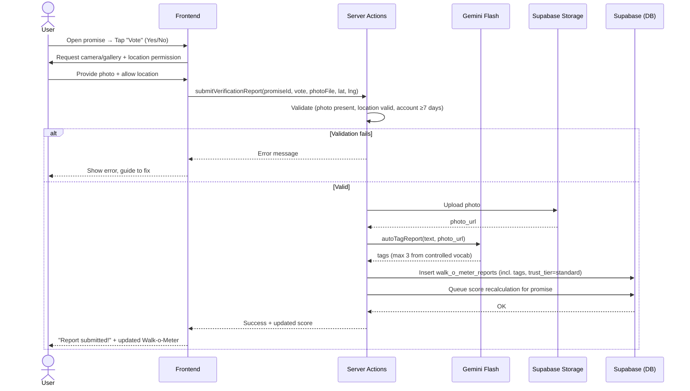
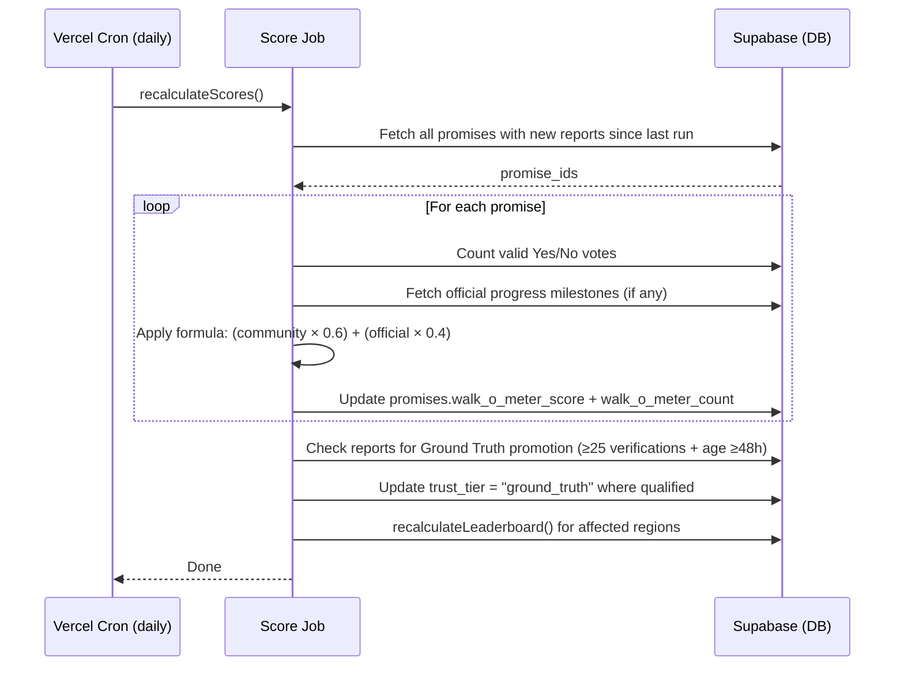

# Feature: Walk-o-Meter — Map & Evidence Feed

> **File naming:** `feat-walk-o-meter.md`

---

## 1. Overview

| Field | Description |
|-------|-------------|
| **Feature ID** | `F-003` |
| **Objective** | Surface real-world evidence ("The Walk") on a map and evidence feed, combining community verification of promises and citizen complaints, and feed the Gap analytics. |
| **Summary** | The Walk-o-Meter has two views: an **interactive Map** (`/map`) and a **List / Evidence Feed** (`/feed`). It shows two report types: (1) **Verifications** — users vote Yes/No on a promise with GPS + photo; votes aggregate into the Walk-o-Meter score. (2) **Complaints** — Surat Pengaduan shared from Bang Jaga appear as map pins. Reports earn a trust tier (Standard → Ground Truth at ≥25 verifications). The right sidebar shows a Regional Leaderboard ranked by resolution rate. Data-Saver mode throttles feed polling and image quality for prepaid users. |
| **Related PRD** | PRD §4.3 |

---

## 2. Functional Requirements

### 2.1 User Stories / Use Cases

| ID | As a… | I want to… | So that… | Priority |
|----|--------|------------|----------|----------|
| US-01 | Citizen | Vote Yes/No on whether a promise is happening | My ground-truth experience is counted | P0 |
| US-02 | Citizen | Submit a vote with a photo and GPS location | My report is credible and geo-linked | P0 |
| US-03 | Citizen | See the Walk-o-Meter score on each promise in The Talk Ledger | I can quickly judge fulfillment | P0 |
| US-04 | Citizen | View a map and evidence feed with both verifications and complaints | I see all on-the-ground activity in one place | P0 |
| US-05 | Citizen | Filter/sort the evidence feed by region, type, or recency | I can focus on what's relevant to me | P1 |
| US-06 | Citizen | See a "View Original Promise" link on a verification report | I can jump to the promise that was being verified | P1 |
| US-07 | Citizen | See a Regional Leaderboard ranked by resolution rate | I know which districts are most accountable | P2 |
| US-08 | System | Aggregate Yes/No votes into a single Walk-o-Meter score per promise | The Talk Ledger can show one clear indicator | P0 |

### 2.2 Acceptance Criteria

- [ ] **AC-01:** From a promise, user can start a vote flow: Yes/No → photo → GPS → submit.
- [ ] **AC-02:** Submission is rejected without a photo or invalid location; user sees a clear error.
- [ ] **AC-03:** Valid reports update the promise's `walk_o_meter_score` (batch every 24h + immediately on new vote).
- [ ] **AC-04:** Score is only computed from valid reports (photo + location + account ≥7 days old).
- [ ] **AC-05:** Photos are uploaded to Supabase Storage; URL and metadata stored in DB.
- [ ] **AC-06:** Map and feed show both report types with distinct visual styling (badge + pin color).
- [ ] **AC-07:** "View Original Promise" link appears on every verification card; if parent promise is deleted, shows "Original promise no longer available."
- [ ] **AC-08:** Evidence posts auto-tagged by AI with up to 3 tags from the controlled vocabulary.
- [ ] **AC-09:** Reports with ≥25 verifications + age ≥48h are auto-promoted to "GROUND TRUTH" badge.
- [ ] **AC-10:** Regional Leaderboard shows top 3 districts in the selected City/Regency ranked by `resolution_rate`.
- [ ] **AC-11:** Data-Saver ON: images load at 30% quality; live polling paused; persistent banner shown.
- [ ] **AC-12:** "Explore All Reports" on the Map view navigates to the List view with the current region pre-applied.

### 2.3 Business Rules

- **BR-01:** A promise-verification report is valid only if it has ≥1 photo AND a GPS location. No photo-only or location-only submissions.
- **BR-02:** **Walk-o-Meter Score formula:**
  ```
  score = (community_score × 0.6) + (official_progress_score × 0.4)
  community_score        = (valid "Yes" votes / total valid votes) × 100
  official_progress      = (confirmed_milestones / total_milestones) × 100
  ```
  If no official progress data exists: `score = community_score × 100%`. Score range: 0–100%.
- **BR-03:** One vote per user per promise. Vote can be changed within 24 hours; locked after that.
- **BR-04:** Votes from accounts < 7 days old are quarantined and do not count toward the score (anti-spam).
- **BR-05:** Bang Jaga complaint reports require a GPS location when shared. They **do not** affect the Walk-o-Meter score; they are shown in the feed as a separate type.
- **BR-06:** Ground Truth auto-promotion: ≥25 unique verifying users + report age ≥48h. System-run; admin can manually demote if evidence found false.
- **BR-07:** Hashtags are AI-generated at submission time from a controlled vocabulary of 10 tags. Max 3 per post.
- **BR-08:** location is stored at report-level (raw lat/lng). Publicly displayed location is rounded to district/city level, not raw GPS.
- **BR-09:** `promise_id` is a required FK on all verification reports. On promise deletion, `promise_id` is set to null and the "View Original Promise" link is replaced with a fallback message.

### 2.4 Feature Dependencies

| Feature | Reference | Dependency type |
|---------|-----------|-----------------|
| Promise Tracker | `docs/features/feat-promise-tracker.md` | Required — provides promises; consumes Walk-o-Meter score |
| Bang Jaga | `docs/features/feat-bang-jaga.md` | Required — complaint reports originate from Surat Pengaduan |
| Region hierarchy | PRD §3.3 | Required — location validation and region scoping |
| Auth | Supabase Auth | Required for submitting reports and votes |

---

## 3. Non-Functional Requirements

### 3.1 Performance

- **Latency:** Report submission (photo upload + metadata) < 5s p95. Score read embedded in promise feed < 2s.
- **Throughput:** Support burst of reports during news events; photo upload via signed URL or chunked.
- **Data volume:** Single promise can have hundreds of reports; use a materialized/stored aggregate score for fast reads.

### 3.2 Availability & Reliability

- **Uptime:** Aligns with app SLA. Report submission degrades gracefully — local draft saved on network failure.
- **Error handling:** Failed photo upload is retryable. Partial submissions (metadata saved, photo failed) are marked `incomplete` and can be retried.

### 3.3 Security & Privacy

- **Auth:** Reading map/feed is public. Submitting reports requires auth.
- **Data:** Raw GPS stored at report-level with access control. Public API returns region-level location only.
- **Compliance:** User consent is required for location + photo storage (shown in submission flow).

### 3.4 Accessibility & UX

- **A11y:** WCAG 2.1 AA; min tap target 48×48dp for Yes/No and submit; location and camera permissions must be clear and cancellable.
- **Localization:** ID primary.
- **Offline / low data:** Data-Saver mode (see BR-11 and §6.3). Failed submissions saved as local drafts (IndexedDB).

### 3.5 Scalability & Limits

- **Rate limits:** Max N reports per user per day (TBD) to limit spam.
- **Storage:** Supabase Storage for photos with defined retention and quota.
- **Leaderboard:** Recalculated daily in a batch job alongside the Walk-o-Meter score update.

---

## 4. Technical Requirements

### 4.1 Architecture Context

- **Layer:** Frontend (Next.js App Router — map + feed UI), Server Actions (submit, score, share, leaderboard), Storage (photos), DB (reports, aggregated score), Scheduled job (score + leaderboard recalculation).
- **Entry points:** `/map` (map view); `/feed` (list view); Vote flow from Promise Tracker card; "Share to Map" from Bang Jaga.

### 4.2 Feature-Specific Packages & Libraries

| Category | Technology / Package | Version | Purpose |
|----------|----------------------|---------|---------|
| **Map** | MapLibre GL JS + OpenStreetMap tiles | — | Interactive map rendering; pins, pop-ups, zoom |
| **Geo** | Browser Geolocation API | — | Capture GPS coordinates for report submission |
| **Image compression** | `browser-image-compression` | — | Client-side resize before upload to reduce bandwidth |
| **AI tagging** | `@google/generative-ai` (Gemini Flash) | — | Auto-generate hashtags from photo + text at submission |
| **Storage** | Supabase Storage | — | Store report photos; signed URLs for public read |
| **Realtime** | Supabase Realtime / Web Push | — | Live feed updates; "New posts available" indicator |

### 4.3 Data Model & APIs

**Entities / tables used:**

- **`walk_o_meter_reports`:** `id`, `report_type` (`promise_verification`|`bang_jaga_complaint`), `promise_id` (nullable FK → `promises.id`), `complaint_id` (nullable FK → `generated_documents.id`), `vote` (`yes`|`no`; for verification only), `photo_url`, `latitude`, `longitude`, `region_id`, `user_id`, `tags` (array, max 3), `verification_count` (for Ground Truth tracking), `trust_tier` (`standard`|`ground_truth`), `status` (`pending`|`accepted`|`rejected`), `created_at`
- **`promises`:** add `walk_o_meter_score` (0–100 float), `walk_o_meter_count` (int)
- **`leaderboard_cache`:** `id`, `region_id`, `resolution_rate` (%), `resolved_count`, `total_count`, `trend` (`up`|`flat`|`down`), `calculated_at`

**Key APIs / Server Actions:**

- `submitVerificationReport(promiseId, vote, photoFile, lat, lng)` — validate, upload photo, insert report, queue score recalculation
- `shareComplaintToMap(complaintId, lat, lng, summary)` — insert report with `report_type = bang_jaga_complaint`
- `getMapReports(regionId?, reportType?, page)` — list reports for map/feed
- `getWalkOMeterScore(promiseId)` — return score + count (or embedded in `getPromiseById`)
- `recalculateScores()` — batch job: run Walk-o-Meter formula for all promises with new votes
- `recalculateLeaderboard(regionId)` — batch job: update `leaderboard_cache`
- `getLeaderboard(cityRegionId)` — return top 3 districts from `leaderboard_cache`
- `autoTagReport(text, photoUrl)` — call Gemini to generate controlled-vocab tags

**External APIs / services:**

- Google Gemini API: auto-tag generation
- Optional: Reverse geocoding API to map lat/lng → `region_id`

### 4.4 Configuration & Environment

- **Env vars:** `SUPABASE_URL`, `SUPABASE_ANON_KEY`, `GOOGLE_GEMINI_API_KEY`, `REPORT_PHOTOS_BUCKET`
- **Feature flags:** `FEATURE_WALK_O_METER` — enable map/feed + scores; `FEATURE_WALK_O_METER_AUTH_REQUIRED` — require auth to view; `FEATURE_GROUND_TRUTH` — enable auto-promotion

---

## 5. Sequence Diagram (Feature & Data Flow)

### 5.1 User submits a verification report (Yes/No + photo + GPS)



### 5.2 Walk-o-Meter score recalculation (batch job)



### 5.3 User views Evidence Feed with live updates

```mermaid
sequenceDiagram
    actor User
    participant UI as Frontend (Evidence Feed)
    participant SA as Server Actions
    participant DB as Supabase
    participant RT as Supabase Realtime

    User->>UI: Open /feed
    UI->>SA: getMapReports(regionId?, reportType?, page=1)
    SA->>DB: Query walk_o_meter_reports
    DB-->>SA: Rows
    SA-->>UI: Feed posts
    UI-->>User: Render cards; skeleton while loading
    UI->>RT: Subscribe to new reports channel
    RT-->>UI: New report event (every ~30s or on change)
    UI-->>User: "New posts available" pill (non-intrusive; user taps to load)
```

---

## 6. Edge Cases & UI States

### 6.1 Empty States

| Scenario | UI Response |
|---|---|
| No reports in selected map region | Faded map overlay: *"No reports yet in this area. Be the first!"* + [Report Issue] button |
| Evidence Feed: no results for filter/search | *"No reports found for this region and filter."* + [Clear Filters] |
| Regional Leaderboard: < 3 districts have data | Show only districts with data; remaining slots show "—" |

### 6.2 Loading States

| Scenario | UI Response |
|---|---|
| Initial Evidence Feed load | 3 skeleton card placeholders (animated shimmer) |
| Map tiles loading | Faded blank canvas; no skeleton (MapLibre handles internally) |
| New posts available (live) | Non-intrusive pill at top of feed: *"New posts available"* — user taps to load; feed does NOT auto-scroll |
| End of feed | [Load More] hidden; *"You've seen all reports in this area."* |

### 6.3 Error States

| Scenario | UI Response |
|---|---|
| Map tiles fail to load | Blank canvas + *"Map failed to load. Check your connection."* + [Retry] |
| Report submission network failure | *"Submission failed. Your report has been saved as a draft."* Draft accessible from Profile → Engagement History |
| Photo upload fails | *"Photo upload failed. Check your connection."* + [Retry] per photo |
| GPS unavailable during submission | *"We couldn't get your location. Make sure GPS is enabled."* Option to enter RT/RW or landmark as text |
| "View Original Promise" and promise is deleted | Link text: *"Original promise no longer available."* (no broken link) |

### 6.4 Permission & Auth States

| Scenario | UI Response |
|---|---|
| Guest views map/feed | ✅ Read-only; no vote/report buttons |
| Guest taps "Vote" or "Report Issue" | Auth bottom-sheet modal |
| Location permission denied | Banner below navbar: *"Enable location for better results."* [Enable Location] deep-links to device settings. Map defaults to national view. |
| Location permission denied during submission | *"Location is required to submit a report."* + [Enable Location Settings] link. Submission blocked. |

### 6.5 Data-Saver Mode States

| When Data-Saver ON | Behaviour |
|---|---|
| Evidence Feed images | Loaded at 30% quality (compressed thumbnails) |
| Map tiles | Reduced resolution tiles |
| Live feed polling | Paused; feed only refreshes on manual pull-to-refresh |
| Auto-play media | Disabled |
| Persistent banner | *"Data Saver is ON — images compressed, live updates paused."* |

### 6.6 Trust Tier Transitions

| Scenario | UI Response |
|---|---|
| Report just submitted | Badge: `VERIFICATION` (blue) |
| Report reaches ≥25 verifications + 48h | System auto-promotes: badge changes to `GROUND TRUTH` (green); post pinned to top of regional feed |
| Admin manually demotes Ground Truth | Badge reverts to `VERIFICATION`; post unpinned |

---

## 7. Open Questions / Decisions

- [ ] **Q1:** One vote per user per promise (auth) vs. anonymous with rate limit — trade-off: accountability vs. friction.
- [ ] **Q2:** Official progress milestones source: where does `official_progress_score` data come from? (Crawled government reports? Manual entry by admin?)
- [ ] **Q3:** Photo moderation: manual review queue or auto-accept with flag-later? Retention period for photos.
- [ ] **Q4:** Whether location must fall within a promise's region (or within X km) for the report to count toward that promise's score.
- [ ] **Q5:** Ground Truth threshold review: is 25 verifications the right bar for MVP, or should it be dynamic (e.g. relative to regional activity)?

---

## 8. Changelog

| Date | Author | Change |
|------|--------|--------|
| 2025-03-04 | — | Initial draft from PRD §4.3 |
| 2025-03-04 | — | Two report types; Share complaint to map flow; data model with report_type |
| 2026-03-05 | — | Gap analysis applied: Walk-o-Meter scoring formula, status labels, Ground Truth trust tier criteria, vote validity rules (account age, 24h lock), hashtag controlled vocab + AI tagging, Regional Leaderboard algorithm, Data-Saver mode spec, promise_id FK + orphan handling, all edge cases |
